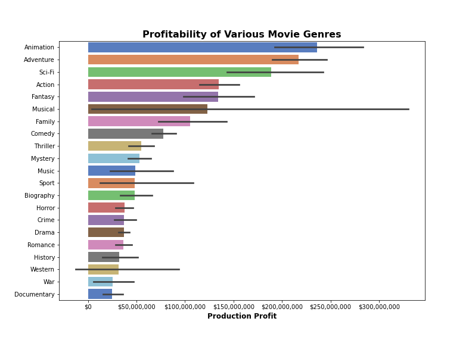
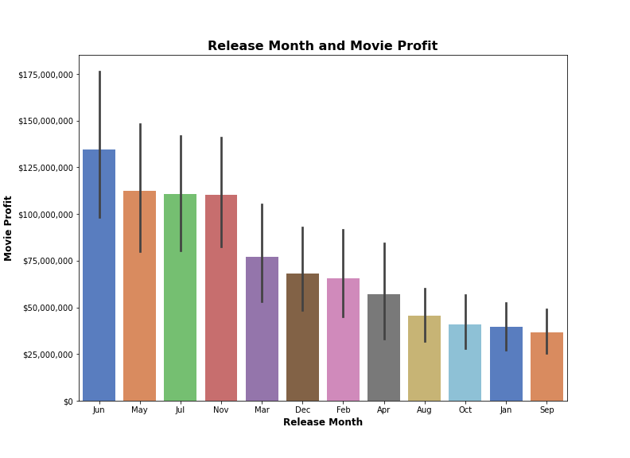
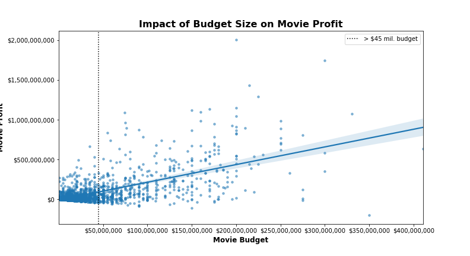
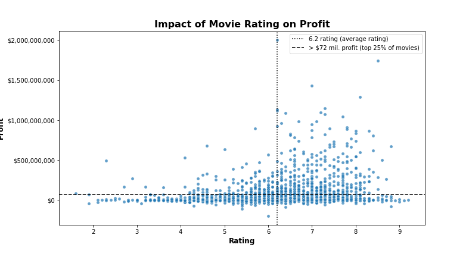

# Microsoft Movie Production Analysis


- **Authors**: Kevin Culver

 

## Overview

The aim of the current project was to provide actionable insights for Microsoft as it launches a new movie production studio. The project analyzed databases to identify variables that contribute to a movie's success at the box office. Analysis showed that certain factors, such as a film's genre, budget, rating, or release date were related to higher profit and return on investment.

## Business Problem

Creating a successful movie studio takes time, money, and risk. However, a company cannot predict how the movies it produces will be received. Therefore, the point of this analysis was to find what qualities are shared by high grossing films that make them successful. For the present analysis, four questions were asked:
1. *What movie genres are most successful?*
2. *What time of year is best to release films?*
3. *Does budget size impact a movie's profit?*
4. *How does a movie's rating affect its profitability?*

By analyzing these questions, business recommendations can be provided that will assist Microsoft in making informed decisions about what types of films to create, when to release films, and other metrics to achieve. 


## Data

The data used in this project comes from two online movie databases - IMDb and The Numbers. Within these databases, each movie is identified by its title or movie id. When combined, these databases provide comprehensive information for each movie, including its genre, rating, release date, budget, and total gross (both domestic and worldwide).

## Methods

This project primarily uses descriptive analysis. The data was analyzed by organizing movies categorically (e.g., by genre) or by visualizing variables using distributions. By visualizing the data using distributions, patterns, relationships, and trends were easy to document and evaluate. 


## Results

For each business question, the results are briefly summarized followed by a visualization of the results.

### Genre and Profit:

The *most profitable* and successful movies genres are:  
1. Animation ($236 million)
2. Adventure ($217 million)
3. Sci-fi ($189 million)

The *least profitable* movie genres are: 
1. Documentary ($24.6 million)
2. War ($25.6 million)
3. Western ($13.2 million)



### Release Month and Profit:

Historically, the summer months (May-July) are the highest profit months for releasing a movie; whereas the fall months (August-October) are not ideal for releasing a movie due to lower profit and performance.



### Budget Size and Profit:

There is a relatively strong correlation between budget size and profit, meaning that movies with larger budgets are more likely to earn higher profit. 

The median budget is 18 million dollars and the top 25% of movies spend over 45 million dollars on their budgets. 



### Average Rating and Profit: 

The average rating for a movie is 6.2. Movies that earn higher than a 6.2 are more likely to also have higher profits. The visual below confirms this. 

The distribution shows that there is a higher density of movies that earn more 72 million dollars in profit (horizontal line) after movies surpass a 6.2 rating (vertical line).




## Conclusions


The evaluation of the data above leads to four business recommendations for Microsoft's entry into movie production.

1.	**Limit creation of movies to certain genres.** Recommended genres are animation, adventure, sci-fi, or action since these genres generally earn higher profits. It is not recommended to produce movies within the documentary, war, or western genres due to historically poor performance at the box office. 
2. **Release movies during the summer months (May-June) and avoid releasing movies in the fall (Aug-Oct).** Movies released in the summer months have done significantly better than movies released during the fall. 
3.	**Budget at least 18 million dollars per movie for a lower budget film and at least 45 million dollars for a higher-budget, high-production movie.**  Higher budget films tend to have higher profit. The average budget for films is 18 million. However, after a budget of more than 45 million dollars, a film is more likely to produce greater profit.
4.	**Strive to release movies that earn at least a 6.2 rating.** Movies that earn higher than a 6.2 average rating are more likely to be successful at the box office and earn greater than 72 million dollars in profit.

## Next Steps

To further improve on the analysis done in this project. The following steps are recommended:

1. **Analyze the budgets of high-grossing, high budget films.** Several factors could contribute to higher budget films having higher profits (e.g., better marketing, top-tier producers and actors, better visual effects). Future research could look into budget distribution to obtain n insights for how to best allocate resources. 

2. **Analyze film characteristics among highly rated films.** The current project concluded  that movies with higher ratings (6.0 or higher) performed better at the box office; however, this finding is quite vague and doesn't produce tangible actions. To improve on this finding, further analysis could be conducted to find characteristics shared among highly-rated movies (e.g., screen-writing, visual effects, fan base, actors, directors).

3. **Perform similar analysis with more recent movies.** One of the main limitations of this project was that it contained movies up to 2019, but did not include movies from 2020 or 2021. To see if these trends continue with more recent movies, it is recommended to collect and analyze data from more recent films.

## For More Information

Please review our full analysis in [our Jupyter Notebook](./Microsoft_Movie_Analysis.ipynb) or our [presentation](./Microsoft_Movie_Presentation.pdf).

For any additional questions, please contact:

 - **Kevin Culver**: culver.coffee@gmail.com

## Repository Structure

Describe the structure of your repository and its contents, for example:

```
├── README.md                           <- The top-level README for reviewers of this project
├── dsc-phase1-project-template.ipynb   <- Narrative documentation of analysis in Jupyter notebook
├── DS_Project_Presentation.pdf         <- PDF version of project presentation
├── data                                <- Both sourced externally and generated from code
└── images                              <- Both sourced externally and generated from code
```
